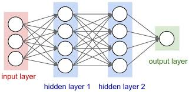
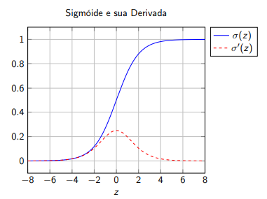
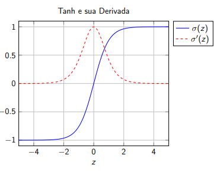
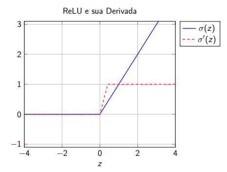

## Aula 2 - 15/09

- Ideia: superar as limitações das redes simples de uma camada, que dependem da linearidade do problema para seu funcionamento. Criar uma camada oculta de neurônios para extrair as features do problema

- Função de kernel: Forma de medir a similaridade da projeção de dois vetores em um espaço de características muito maiores, possivelmente infinita, sem precisar calcular essa projeção explicitamente. A função de kernel calcula o produto interno.

- Risco teórico e empírico: 
    - Em tese gostaríamos de criar um modelo, que conseguisse representar completamente toda a distribuição real de dados. Nisso o risco teórico é dado pela média do erro sobre toda essa distribuição:
    
    $$R(f) = \mathbb{E}_{(x,y)\sim \mathcal{D}} \big[ L(h(x), y) \big]$$
    
    - Em que $h$ é o modelo, $L$ é a função de perda e $D$ é a distribuição real dos dados.

    - Como isso não é possível, a gente precisa calcular o risco baseado no que tem, que é a amostra dos dados. Com isso o risco empírico, para os dados de treinamento é:

    $$\hat{R}(h) = \frac{1}{N} \sum^{N}_{n=1} L\big( h(x_n), y_n \big)$$

    - Mas aí também não dá para se basear somente no risco empírico né? Isso poderia levar ao overfitting do modelo aos dados de treino. Então a solução que surge é minimizar o *risco empírico regularizado*.

    $$J(\theta) = \hat{R}(h_\theta) + \lambda \Omega(\theta)$$
    
    - Essa segunda parte serve para impedir que o modelo se molde demais aos dados de treino.

- Multilayer Perceptron (MLP) e Feedfowards Neural Networks(FNN)

    
    - Formada pela composição de várias camadas de transformações afins seguidas por funções de ativação não lineares 
    - A entrada de uma camada, que não seja a primeira, vai ser dada pela ativação da camada anterior. E a saída dada pela ativação $a_l = \sigma(z_l)$, em que  $z_l = W_l \space a_{l-1} + b_l$
    
- Funções de ativação do MLP
    - Sigmoide:

    $$\sigma(z) = \frac{1}{1 + e^{-z}}$$
    
    

    - Tangente hiperbólica

    $$\sigma(z) = tanh(z) = \frac{e^z - e^{-z}}{e^z + e^{-z}}$$

    
    
    - ReLu

    $$\sigma(z) = max(0,z)$$

    

    - Softmax: usada para classificação multiclasse, em que k é uma das classes.

    $$softmax(z)_k = \frac{exp(z_k)}{\sum^K_j exp(z_j)}$$

- Backpropagation: obviamente, a gente não vai ter um resultado bom com só uma "ida" para frente da rede neural. Para corrigir isso, o algoritmo de backpropagation é usado para corrigir os parâmetros dos neurônios.
    - Numa regressão o normal seria apenas fazer a regra de atualização com a descida de gradiente "padrão", tipo $w \leftarrow w - \eta \frac{\partial J}{\partial W}$. 
    - Entretanto, como aqui a gente tem várias camadas de neurônios isso não pode ser feito de maneira tão simplória.
    - A solução então é calcular o erro na camada de saída e ir propagando ele para trás, para isso deve-se aplicar a regra da cadeia de maneira recursiva para calcular os gradientes dos neurônios, começando da última camada e indo até a primeira.

- Resumindo o backpropagation:
    - Foward: os neurônios calculam as previsões
    - Backward: calcula quanto cada peso de cada neurônio contribuiu para o erro, usando a regra da cadeia.
    - Nisso a gente repete esse processo de ir e voltar para conseguir melhorar as previsões da rede.

- ***Obs***: em implementações de redes neurais, é  usado autodiferenciação em vez do backpropagation clássico, pela sua flexibilidade e generalidade, dado que a autodiferenciação é usada para calcular derivada de qualquer computação que pode ser expressa como um grafo computacional.